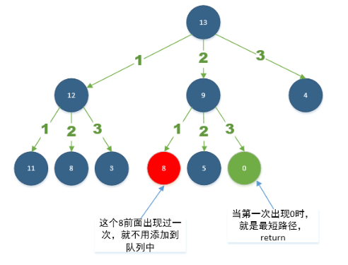

# Question 279
## description
给定正整数 n，找到若干个完全平方数（比如 1, 4, 9, 16, ...）使得它们的和等于 n。你需要让组成和的完全平方数的个数最少。

### 1.动态规划：
初始华数组dp,长度为n+1；dp[i] 表示整数为i时组成该整数时的最小平方数的个数，则动态规划动态转移方程式：
```
   dp[i] = min(dp[i-j*j],(dp[i] + 1));
``` 

其中，*j* 表示不大于i的正整数,且 *j\*j <= i*,初始化dp[i]时，dp[i] = i, 即每个n**最差**情况由n个1相加得到；

### 2.BFS广度优先搜索：

直接上图，图片为leetCode中文版解题中复制得到的；



图中，以13为例: *不大于13*的完全平方数有1(1\*1)，4(2\*2)，9(3\*3),如果分别由这些数组成13，那么可以得到的子节点有13-1=12，13-4=9，13-9=4，这些子节点又可以重新构成其子节点。当某一个子节点为0时（图中绿色节点），表明从根节点到该节点可以完全拆分完，由于时广度优先，所以可以是最短的，路径上的节点数就是题目要求的值（不包括子节点）。同时我们可以看到有的节点（图中红色）和之前12中的节点有一个重复的，所以不需要再次重复计算，因为以这个节点计算至少大于之前出现的节点。

解题代码请看相关文件。


