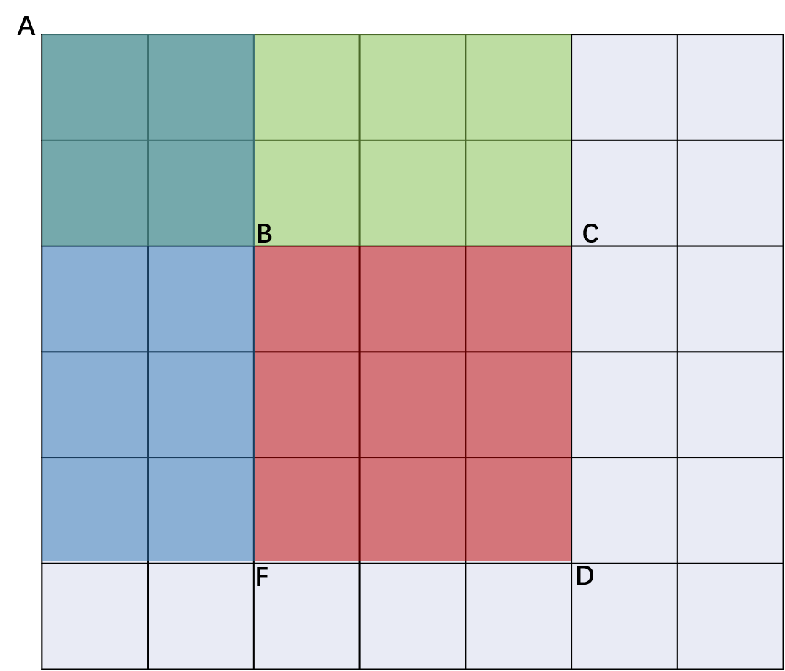

# [Solution 304](https://leetcode-cn.com/problems/range-sum-query-2d-immutable/)
## description
给定一个二维矩阵，计算其子矩形范围内元素的总和，该子矩阵的左上角为 (row1, col1) ，右下角为 (row2, col2)。
>说明:
>你可以假设矩阵不可变。会多次调用 sumRegion 方法。你可以假设 row1 ≤ row2 且 col1 ≤ col2。
### 1.暴力求解
&emsp;&emsp;根据给定的矩阵与求解区域坐标点，在改区域内逐点求和计算，得出结果即可。伪代码如下：
```
function sum(row1,col1,row2,col2,martix){
    for(int i= row1;i<=row2;i++){
        for(int j= col1;j<=col2;j++){
            result = result + martix[i][j];
        }
    }
    return result;
}
```
### 2.动态规划算法
&emsp;&emsp;为了更好说明该思路，我们先来看一维矩阵的情况。在一维矩阵中，为了求解某个区间的和，我们可以先求解从起始点(0,0)到每一个点结束的区间和。然后用该区间和的结果，从求解区间结束点的区间和减去起始点的区间和，其结果为该段区间的区间和。

&emsp;&emsp;基于一维数组的例子，我们也可以利用类似的思路求解二维数组。我们先初始化一个二维数组dp，其中dp[i][j]表示从给定矩阵(0,0)点到该点的区间的和。为了按照题目要求求解给定范围的区间和，我们可以在已经求出的dp数组中进行运算，得到结果。如图所示：
>>>>> 
&emsp;&emsp;假设要求出BD(对角线)所在区域的和，我们可以用AD(对角线)区域的和减去AC(对角线)的和以及AF(对角线)的和，然后再加上AB(对角线)区域的和。而这些区域的和我们已经在dp中求出，所以BD区域的和计算公式如下:
>>>>>region_sum_BD=dp[BD]-dp[AC]-dp[AF]+dp[AB];

&emsp;&emsp;该方法每次计算对角线的和O(1),所消耗时间主要在于dp数组的初始化，该操作时间复杂度为O(mn),所以总的算法时间复杂度为O(mn),空间复杂度需要辅助数组dp，为O(mn)。