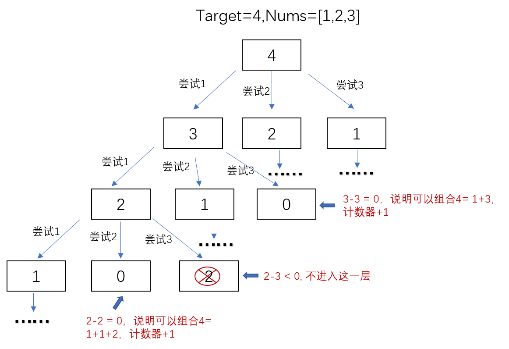
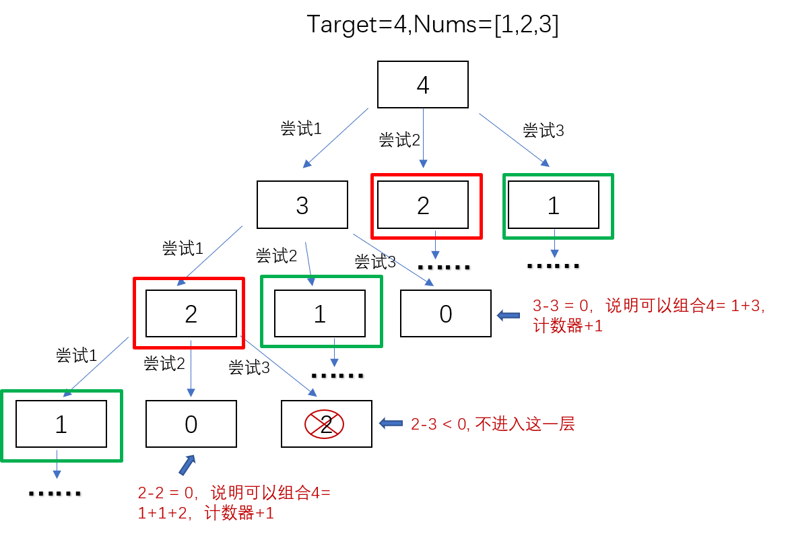

# [solution377](https://leetcode-cn.com/problems/combination-sum-iv/)
## description
给定一个由正整数组成且不存在重复数字的数组，找出和为给定目标正整数的组合的个数。

示例：
>nums = [1, 2, 3],target = 4所有可能的组合为：    
(1, 1, 1, 1)   
(1, 1, 2)   
(1, 2, 1)   
(1, 3)   
(2, 1, 1)   
(2, 2)   
(3, 1)   
请注意，顺序不同的序列被视作不同的组合。  
因此输出为 7。
    
### 解法1 动态规划
采用动态规划算法，假定dp[i]表示目标为i的正整数由给定nums组成的个数，则:
> dp[i]=sum(dp[i-nums[j]]),0<=j<=nums.length;其中i-nums[j]>=0
    
该算法的时间复杂度为O(n),空间复杂度为O(n)。

### 解法2 暴力解法
暴力解法就是对于给定的nums数组中每一个数进行尝试，看是否可以组合为target，每组合成为一个则计数器加1。那么如何进行暴力呢，我们可以用递归进行，以target=4，nums=[1,2,3]为例，如图所示：    
>     

所以，我们可以递归写出该算法。该算法的时间复杂度O(a^n).该算法在leet中会超时。

### 解法3 优化后的暴力解法
通过解法二我们可以知道，在求解的工程中存在大量的重复计算，如图：
>     

节点2(红色框)被计算了两次，节点1(绿色框)被计算了三次，如果我们能够把已经计算出的结果进行保存，则可以减少很多重复计算，减少递归的深度。所以在解法2的基础上，带上一个类似笔记本的数组，把计算出的结果记录在本子上，每次尝试进行下一层的计算时，先查看一下笔记本是否有结果，如果有则直接返回结果，否则再计算。通过优化后，进行测试，可以顺利通过。

